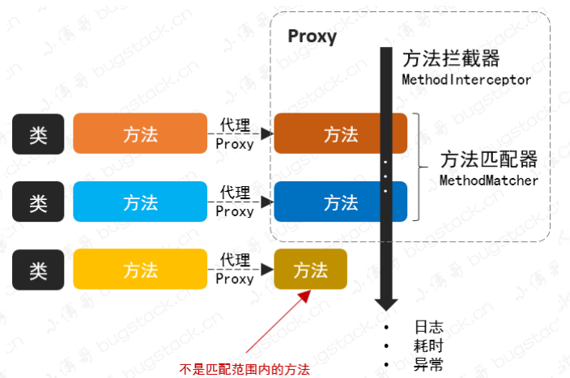
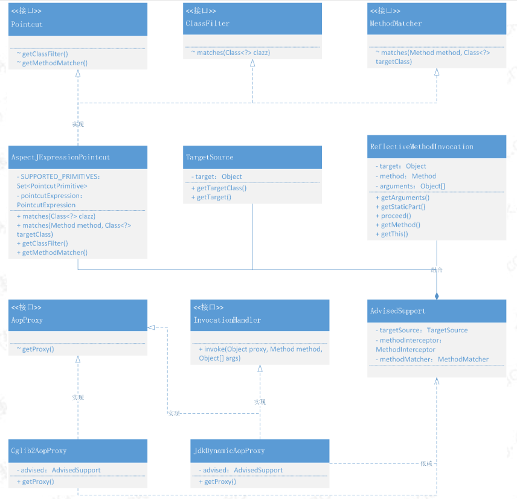
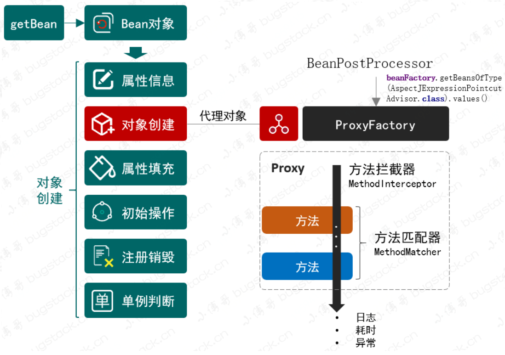
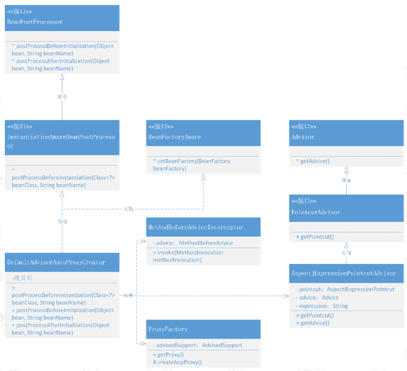
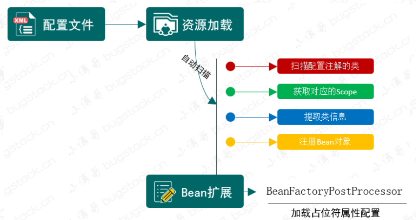
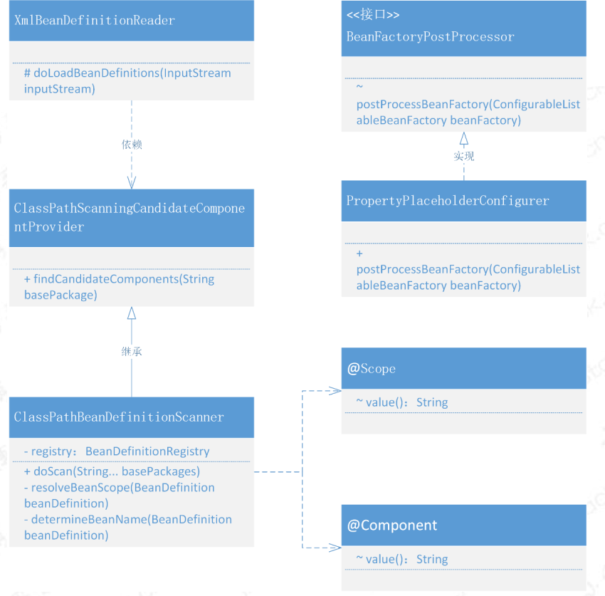
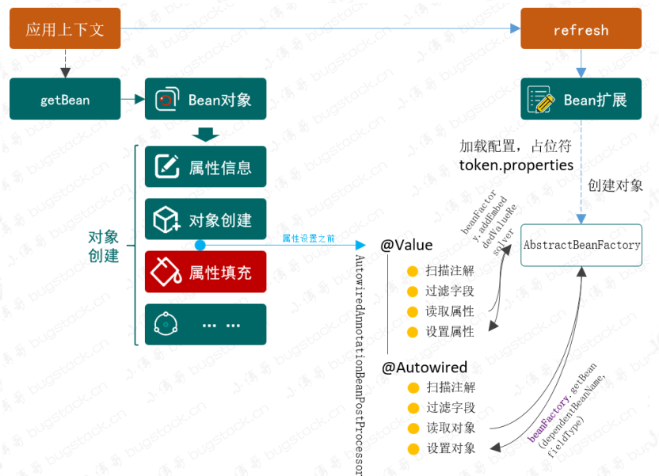

# 流程梳理
## 从资源角度
1) **资源定义**
所有的资源全部定义为"流"的形式；
2) 完成资源的加载ResourceLoader
3) **资源加载**：BeanDefinitionReader
完成资源定义和资源加载的同时， 对加载后的资源进行注册， 注册的容器为BeanDefinitionRegistry
此处针对XML文件进行解析的实现类为：XMLBeanDefinitionReader
4) **BeanDefinition注册**：BeanDefinitionRegistry
资源注册中心的核心实现类为DefaultListableBeanFactory, 其核心目标是为了从注册中心获取的Bean定义给到父类接口或者抽象类使用
5) **BeanDefinition获取**：DefaultListenableBeanFactory


## 从BeanFactory角度
1) BeanFactory完成的核心功能就是从容器中拿出指定的对象
2) AbstractBeanFactory完成的是， 对Bean的创建流程进一步拆分：
- 从SingletonBeanRegistry中获取现存的Bean，获取不到则进行下一步
- 定义抽象方法， 获取到BeanDefinition信息
- 定义抽象方法， 根据BeanDefinition的信息创建具体的Bean
- 根据获取到的Bean， 判断是否为FactoryBean， 如果是的话， 则调用FactoryBean的方法完成Bean的创建

3) 针对上面的步骤， 考虑到类的职责细分:
- AbstractAutowireCapableBeanFactory完成Bean的创建
内部根据Bean创建的不同策略， 比如Cglib/构造器形式创建没有属性具体值的Bean
创建Bean之后将Bean的属性信息赋值
Note: 以上两个步骤均依赖BeanDefinition!!
完成Bean的属性赋值之后， 判断是否是Aware接口， 如果是的话， 完成Aware信息的绑定；
完成以上步骤之后， 执行BeanPostProcessorsBeforeInitialization和BeanPostProcessorsAfterInitialization
在此期间，完成invokeInitMethod方法的处理(InitializingBean接口或者属性配置init-method)；

- DefaultListenableBeanFactory完成BeanDefinition的获取
实现了BeanDefinitionRegistry接口从注册中心获取， 来源可以是外部用户输入的， 也可以是后续的读取XML资源信息

## 从Bean定义角度
1) Bean的核心是一个Class和对应的属性
根据Class可以获取对应的构造器和参数
2) 属性的值可以是普通的对象或者引用对象， 此处的区分表现为：Object的类型为BeanReference
根据创建好的Bean可以完成对属性值的绑定

## 从使用角度
1) DefaultListenableBeanFactory/XMLBeanDefinitionReader
两者虽然已经很方便进行配置化、灵活支持Bean的注册和获取，但是这两个步骤是否可以进一步合并？ 
作为BeanFactory的Bean初始化的步骤，只是支持了基本的功能，还不具备一定的扩展性；
2) 是否存在一个统一的入口 
方便使用方完成Bean的定义、加载、注册、初始化、获取、使用、销毁等一系列过程呢
且支持对中间的过程进行动态的扩展的机制呢

3) 初始化和销毁方法
- 在xml配置文件中增加init-method和destroy-method, 对应到BeanDefinition的属性中
- 当initialzeBean初始化操作过程中，就可以通过反射的方法来调用属性配置的方法信息
- 如果是接口实现的方式，可以直接通过Bean对象调用对应接口定义的方法接口(InitialingBean(Bean)).afterPropertiesSet()
- 当Bean对象初始化完成，会注册销毁方法到DefaultSingletonBeanRegistry中的disposableBeans属性中，统一进行处理；

3.1) 用途
接口暴露，数据库数据读取，配置文件加载等

### 统一使用
1) 定义ApplicationContext暴露统一的入口给用户使用
而非先创建DefaultListableBeanFactory，配合XMLBeanDefinitionReader完成Bean的定义、加载和初始化

3) ConfigurableApplicationContext
定义refresh() 
4) AbstractApplicationContext
对refresh方法的骨架定义， 主要包括四个步骤：
- 定义了BeanFactory的创建：refreshBeanFactory()
- BeanFactoryPostProcessor的获取和执行
- BeanPostProcessor的注册
- 提前初始化单例Bean
5) AbstractRefreshableApplicationContext
执行refreshBeanFactory方法， 主要目的是创建工厂: DefaultListableBeanFactory；
完成BeanDefinition的加载方法的定义
6) AbstractXmlApplicationContext
完成XMLBeanDefinitionReader的定义， 根据其方法完成BeanDefinition的加载
核心代码
```java
XMLBeanDefinitionReader xmlBeanDefinitionReader = new XMLBeanDefinitionReader(beanFactory, this);
```
7) ClassPathXMLApplicationContext
对外暴露的接口， 主要给出资源的路径即可

## 从扩展角度
哪些地方可以完成对Bean对象的扩展机制？
- BeanDefinition生成后是否可以支持动态的修改其定义， 而不是从原有的资源处定义后不可以再修改(不可变)
引出接口BeanFactoryPostProcess， 其主要是在Bean注册后，但是未初始化之前执行BeanDefinition的修改操作
- createBean前后是否可以支持一些动态修改
引出接口BeanPostProcess， 完成Bean的初始化前后修改操作

### Aware感知容器对象
如果想要获取到Spring框架提供的BeanFactory、ApplicationContext、BeanClassLoader等，进一步做一些扩展框架的使用
该怎么设计？
- Spring提供的这些资源， 其获取方式怎么定义？
通过定义标记接口， 类似InitialingBean， 这个标记接口不需要有任何接口方法， 只起到标记作用；
具体的功能由继承此接口的其他功能性接口来完成， 在代码里面通过InstanceOf来进行判断和调用；
定义Aware接口，其实现有：BeanFactoryAware/BeanClassLoaderAware/BeanNameAware/ApplicationContextAware
其实现能感知到容器中的相关对象
- 这些获取方式怎么和Spring框架无缝衔接？

### FactoryBean
交给Spring管理的Bean对象一定是用户类创建出来的么？有没有可能通过定义接口， 然后具体的实现类是由Spring来管理的呢？
- 在ORM框架中， 我们一般只会定义一个接口， 也并没有创建任何操作数据库的Bean对象， 但是这就可以完成对数据库的读取了。
- 问题简化为： 如何完成把复杂且以代理方式将动态变化的对象注入到Spring容器呢。
- 另外， 创建好的对象一定是单例的么？ 有木有可能是非单例的？

以上问题就都可以通过FactoryBean来解决， 让使用者定义复杂的Bean对象， 且根据对象的类型(是否单例)来创建。
- 对外提供一个可以从FactoryBean的getObject方法中获取对象的功能即可， 这样所有实现此接口的对象类， 就可以扩充自己的对象
功能了。
- MyBatis就实现了一个MapperFactoryBean类， 在getObject方法提供SqlSession执行CRUD的操作。

思路：
createBean完成对象的创建、属性填充、依赖加载、前置处理、初始化方法处理、后置处理；最后可以加上一个判断当前对象是否是一个
FactoryBean对象， 如果是的话， 就需要继续执行获取FactoryBean具体对象的getObject对象了， 整个getBean过程新增一个创建
类型的判断， 用于确定是否使用内存来存放对象， 如果要存放到内存，就是单例；否则每次都要重新创建；

### 容器事件以及时间监听器
观察者模式：作为对象的一对多依赖关系， 当一个对象的状态变更时，将所有依赖于它的对象都同步通知一遍。
Spring event事件监听功能：
- 事件类：Event
- 事件监听: Listener
- 事件发布

在Spring#AbstractApplicationContext#refresh()方法中， 便于完成事件初始化和注册事件监听器的操作。

## 方法代理
一个可以代理方法的Proxy，调用方法拦截器MethodInterceptor#invoke()，而不是Method#invoke()；
另外，还需要对拦截表达式进行处理。

在Spring框架中是一个非常重要的内容，使用 AOP 可以对业务逻辑的各个部分进行隔离，从而使各模块间的业务逻辑耦合度降低，
提高代码的可复用性，同时也是为了提高开发效率。

AOP的核心技术就是对动态代理的使用， 给出一个接口的实现类， 就可以使用代理的方式替换掉这个实现类。

那么， 怎么给方法进行代理呢？怎么去代理所有符合某些规则的类方法呢？如果可以代理掉所有的类方法， 就可以做一个方法拦截器， 给
所有被代理的方法添加上一些自定义的处理， 比如打印日志、记录耗时、监控异常等。

就像你在使用 Spring 的 AOP 一样，只处理一些需要被拦截的方法。在拦截方法后，执行你对方法的扩展操作。
- 那么我们就需要先来实现一个可以代理方法的 Proxy，其实代理方法主要是使用到
**方法拦截器类**处理方法的调用 MethodInterceptor#invoke，而不是直接使用 invoke 方法中的入参 Method method 进行
method.invoke(targetObj, args) ; 这块是整个使用时的差异。
- 除了以上的核心功能实现，还需要使用到org.aspectj.weaver.tools.PointcutParser 处理拦截表达式
"execution(*cn.springframework.test.bean.IUserService.*(..))"，有了方法代理和处理拦截，我们就可以完成设计出一个 AOP 的雏形了。




拆解后总结：
- 通过拆分后基本可以明确类职责划分情况，包括：代理目标对象属性、拦截器属性、方法匹配属性， 以及两种不同的代理操作JDK和CGlib的方式；

问题: 怎么和Spring框架整合，通过配置的方式完成切面的操作。其实质是： 如何和Spring结合， 完成代理对象的注入操作?

- 怎么借着 BeanPostProcessor 把动态代理融入到 Bean 的生命周期中，以及如何组装各项切点、拦截、前置的功能和适配对应的代理器。

1) 为了可以让对象创建过程中，能把 xml 中配置的代理对象也就是切面的一些类对象
  实例化，就需要用到 BeanPostProcessor 提供的方法，因为这个类的中的方法可以分别作用与 Bean 对象执行初始化前后
  修改 Bean 的对象的扩展信息。但这里需要集合于 BeanPostProcessor 实现新的接口和实现类，这样才能定向获取对应的类信息。

2) 但因为创建的是代理对象不是之前流程里的普通对象，所以我们需要前置于其他对象的创建，所以在实际开发的过程中，需要在
  AbstractAutowireCapableBeanFactory#createBean 优先完成 Bean 对象的判断，
  是否需要代理，有则直接返回代理对象。 在 Spring 的源码中会有 createBean 和doCreateBean 的方法拆分。

3) 这里还包括要解决方法拦截器的具体功能，提供一些 BeforeAdvice、 AfterAdvice的实现，让用户可以更简化的使用切面功能。
  除此之外还包括需要包装切面表达式以及拦截方法的整合，以及提供不同类型的代理方式的代理工厂，来包装我们的切面服务。



# 第二部分
## 总结上面
上面包含了Spring基本的IOC和AOP功能，但是配置化信息太多，能否进一步简化配置，简化使用呢？
比如：　包的扫描注册、注解配置的使用、占位符属性的填充等等；

### 自动扫描
要完成Bean对象的注册是自动扫描完成的， 需要以下基本操作：
扫描路径人口、XML解析扫描信息、待扫描Bean对象进行注解标记、扫描Class对象获取Bean注册的基本信息、组装注册信息、
注册Bean对象;
通过以上步骤就可以完成自定义注解和配置扫描路径的情况下， 完成Bean对象的注册； 除此之外， 可以完成配置属性中
占位符特点给Bean注入属性信息。
- 备注： 以上操作可以通过BeanFactoryPostProcessor, 可以处理所有的BeanDefinition加载完成后， 实例化Bean对象之前，
提供修改BeanDefinition属性的机制。


结合 bean 的生命周期，包扫描只不过是扫描特定注解的类，提取类的相关信息组装成 BeanDefinition 注册到容器中。

在 XmlBeanDefinitionReader 中解析<context:component-scan />标签，扫描类组装 BeanDefinition，
然后注册到容器中的操作在 ClassPathBeanDefinitionScanner#doScan 中实现， 包含对类的扫描和获取注解信息等。

- 自动扫描注册主要是扫描添加了自定义注解的类，在 xml 加载过程中提取类的信息，组装 BeanDefinition 注册到 Spring 容器中。
- 关于 BeanFactoryPostProcessor 的使用，因为我们需  要完成对占位符配置信息的加载，所以需要使用到 
BeanFactoryPostProcessor。在所有的 BeanDefinition 加载完成后，实例化 Bean 对象之前，修改BeanDefinition 的属性信息。



整个类的关系结构来看，其实涉及的内容并不多，主要包括的就是 xml 解析类
XmlBeanDefinitionReader 对 ClassPathBeanDefinitionScanner#doScan 的使用。
 在 doScan 方法中处理所有指定路径下添加了注解的类，拆解出类的信息：名
称、作用范围等，进行创建 BeanDefinition 好用于 Bean 对象的注册操作。
 PropertyPlaceholderConfigurer 目前看上去像一块单独的内容，后续会把这块的内
容与自动加载 Bean 对象进行整合，也就是可以在注解上使用占位符配置一些在配
置文件里的属性信息。

### 属性自动注入
上面实现的功能可以完成自动扫描带有@Component的对象完成自动装配和注册Bean到Spring容器中，那么Bean配置中对应的属性
怎么注入呢， 此时就需要使用@Autowired、@Value注解， 完成对属性和对象的注入。


围绕Bean的生命周期， 修改Bean的定义我们提供BeanFactoryPostProcessor，处理Bean的属性要用到BeanPostProcessor；

要处理自动扫描注入，包括属性注入、对象注入，则需要在对象属性applyPropertyValues 填充之前 ，把属性信息写入到
PropertyValues 的集合中去。这一步的操作相当于是解决了以前在 spring.xml 配置属性的过程。

 而在属性的读取中，需要依赖于对 Bean 对象的类中属性的配置了注解的扫描，field.getAnnotation(Value.class); 
依次拿出符合的属性并填充上相应的配置信息。 这里有一点 ，属性的配置信息需要依赖于
BeanFactoryPostProcessor 的实现类 PropertyPlaceholderConfigurer，把值写入到
AbstractBeanFactory 的 embeddedValueResolvers 集合中，这样才能在属性填充中利用 beanFactory 获取相应的属性值

 还有一个是关于 @Autowired 对于对象的注入，其实这一个和属性注入的唯一区
别是对于对象的获取 beanFactory.getBean(fieldType)，其他就没有什
么差一点了。
